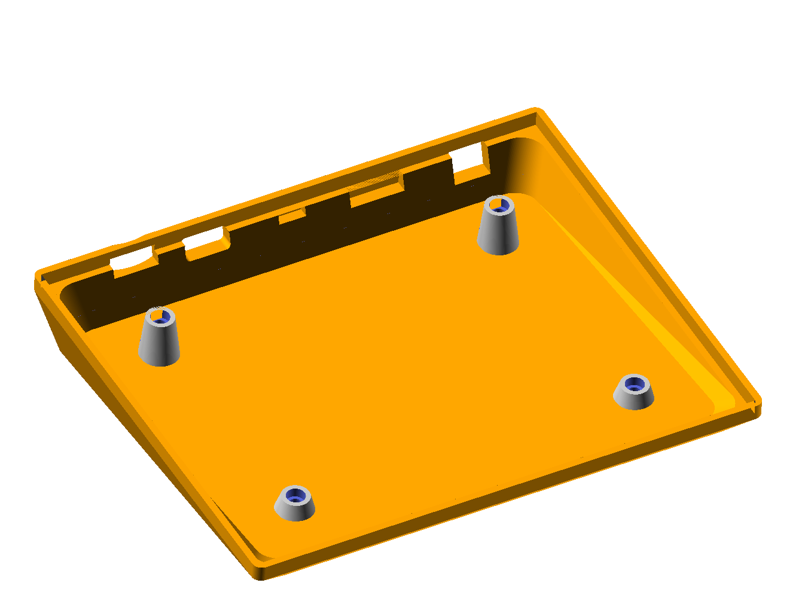

This is the OpenSCAD source for the acrylic plate and 3D-printed case I used
for my _merp_ keyboard. This can be adapted to support a variety of ortholinear
keyboards with arbitrary layout sizes and PCB mounting holes -- just read
through the first lines of the file that define 

Some notes:
 * This case is "borderless". This is mainly for aesthetic reasons in split 
 keyboards, where you'd probably want to be able to stick the two halves 
 together without creating an odd gap in the matrix
 * The case assumes standard Cherry MX switches on a 19mm gird
 * If you are using this for your own keyboard, make sure you have cut out 
 holes for USB, TRRS cables, etc at the correct locations. You can modify the
 `components()` module to import a 3D model of your PCB, so you can see if it
 fits without any issues

# Acknowledgements:
I use other people's models for creating the preview of the assembled keyboard:
* Cherry-MX switches from https://bitbucket.org/gcb/3dump
* Keycaps from https://www.thingiverse.com/thing:2178185
    
